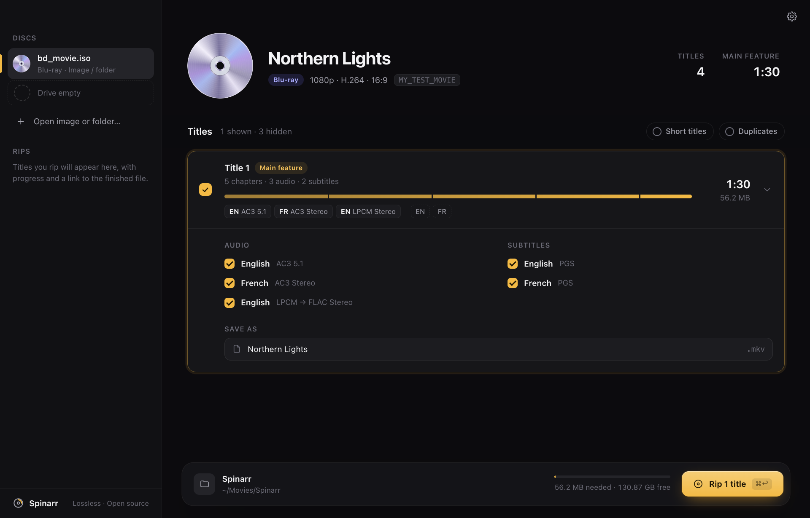
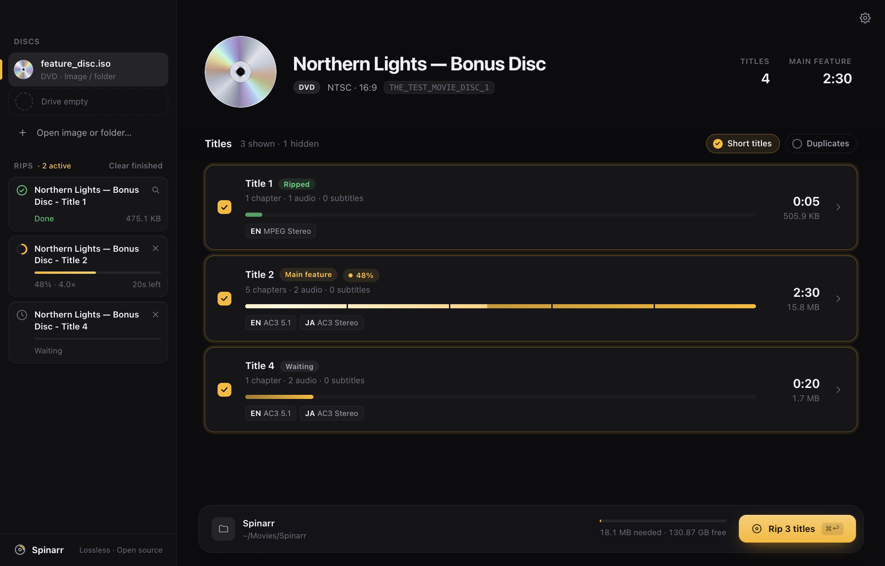
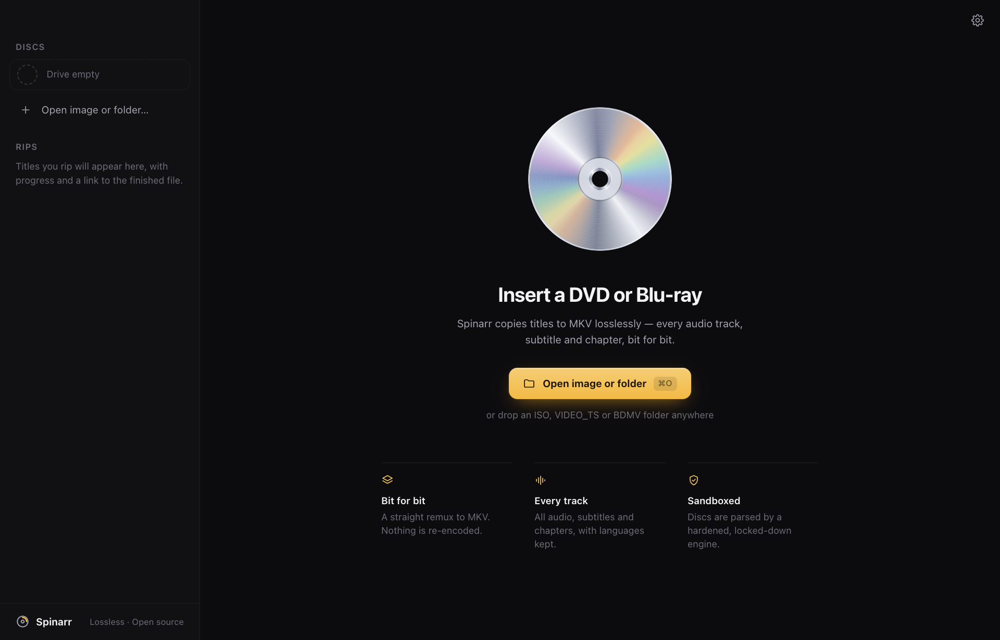
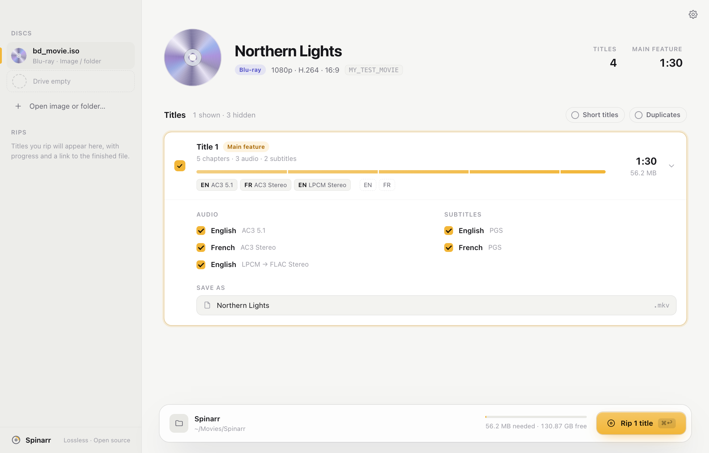

# Spinarr

**An open-source DVD and Blu-ray → MKV ripper for macOS with a modern UI.** It's a friendlier, auditable take on MakeMKV.

Spinarr copies titles **losslessly**. You get the original MPEG-2 video, every audio track (AC3, DTS, LPCM, MPEG), VobSub subtitles, chapters and language tags, remuxed into MKV with no re-encoding. The test suite proves it: decoded video is bit-identical to the source, and every audio packet survives byte for byte.

<p align="center">
  
</p>

## Features

- **Finds discs on its own.** Inserted discs are detected automatically. You can also open, or drag in, an ISO, a disc folder or a `VIDEO_TS` folder.
- **Picks out the movie.** The **main feature** is preselected. Logos, menus and **duplicate playlist titles** (a common copy-protection trick) are hidden.
- **Shows what's on each title.** Every title gets a chapter timeline plus language, codec and channel chips. Pick exactly which audio and subtitle tracks to keep.
- **Rip queue.** Shows progress, speed and time left, with cancel and *Show in Finder*. It checks free space first, never overwrites files, and never leaves partial files behind.
- **Honest failures.** A scratched or unreadable disc fails with a clear message instead of a silently truncated file.
- **Light and dark mode.**
- **Blu-ray (early).** Playlists, chapters and track languages; lossless rips (Blu-ray LPCM → FLAC, everything else copied). Unencrypted discs work today. For AACS discs, install `libaacs` and supply your own `KEYDB.cfg`: Spinarr never ships or downloads keys. BD+ and 4K UHD aren't supported. Tested on generated discs; real-drive testing is pending.

## Screenshots

<table>
  <tr>
    <td colspan="2"><br><sub><b>Ripping.</b> Live progress on each title card and in the Rips list.</sub></td>
  </tr>
  <tr>
    <td width="50%"><br><sub><b>Start screen.</b> Insert a disc, or open or drop an image or folder.</sub></td>
    <td width="50%"><br><sub><b>Light mode.</b> Follows your system appearance.</sub></td>
  </tr>
</table>

## Keyboard

| Keys | Action |
| --- | --- |
| ⌘O | Open an image or folder |
| ⌘↩ | Rip the selected titles |
| ⌘A | Select or deselect every visible title |
| ↑ ↓ | Move between titles |
| Space | Select the focused title |
| ↩ / → / ← | Expand or collapse the focused title's tracks |
| ⌘, | Settings |

## Security

A DVD is untrusted input parsed by C code, so Spinarr treats it that way:

- **Sandboxed engine.** The scanner and ffmpeg run under a macOS sandbox:
  - no network, no starting other programs
  - no access to your files except the source
  - writes only to your output folder
- **Patched, fuzzed parsers.** libdvdread is built from verified source with memory-safety fixes found by fuzzing. Those fixes are being sent upstream.
- **Locked-down UI.** No Node.js in the UI, a strict CSP, and every request to the backend validated.

See [SECURITY.md](SECURITY.md) and the full [security testing report](docs/SECURITY_TESTING.md).

## How it works

| Piece | Role |
|---|---|
| `engine/dvdinfo.c`, `engine/bdinfo.c` | Small libdvdread / libbluray tools that dump a disc's titles or playlists (durations, chapters, sizes, tracks, encryption) as JSON in one pass |
| `engine/bin/ffmpeg`, `ffprobe` | Remux-only ffmpeg 8 build with the `dvdvideo` demuxer, statically linked against patched libdvdread/libdvdnav |
| `engine/patches/` | Spinarr's fixes to ffmpeg (lossless AC3, 5× faster real-drive reads, short Blu-ray playlists), libdvdread and libbluray (memory safety, found by fuzzing) |
| `libdvdcss` | Loaded at runtime from **your** install to read CSS-encrypted discs. Spinarr doesn't ship it. |
| `app/` | Electron shell: hardened main process, a preload bridge, and a plain HTML/CSS/JS UI |

## Getting started

```sh
brew install meson ninja nasm pkg-config libdvdcss
npm install
npm run engine      # downloads verified sources, applies patches, builds engine/bin (~5 min)
npm start
```

## Testing

```sh
brew install ffmpeg dvdauthor cmake   # test-media generators (tsMuxeR is built from source) and independent oracle
npm run fixtures                # builds a set of test DVDs (NTSC/PAL, 4:3/16:9, 5.1, subtitles, multi-titleset, broken, hostile)
npm test                        # unit → security corpus → engine → end-to-end
```

Every feature maps to a user story with acceptance criteria: [docs/USER_STORIES.md](docs/USER_STORIES.md). Real-drive results: [docs/HARDWARE_TESTING.md](docs/HARDWARE_TESTING.md). See [CONTRIBUTING.md](CONTRIBUTING.md) for details.

## Roadmap

- Signed and notarized `.dmg` releases (bundled engine, Electron fuses, hardened runtime)
- More real-hardware coverage (multi-angle, seamless branching, damaged discs)
- Windows and Linux
- Blu-ray: real-drive testing, multi-clip and multi-angle playlists, 3D/MVC (UHD stays out of scope)

## Legal

Spinarr is for making personal backups of discs you own. Getting around copy protection may be restricted where you live (for example, DMCA §1201 in the US). Spinarr doesn't include `libdvdcss` or any decryption keys.

## License

GPL-3.0-or-later. Spinarr links GPL components of ffmpeg and libdvdread.
